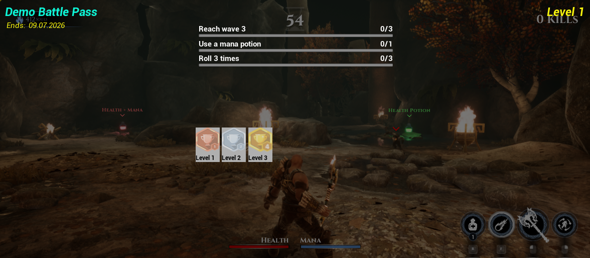

# SCILL-Unreal example projects.

These example projects integrate the SCILL Unreal SDK. For further information on each project have a look at their respective documentation.

## Prerequisites

To run the example projects, the SCILL Unreal SDK has to be installed either to your engine's or into your project's Plugin directory. Please take a look at this guide on installing the SCILL plugin: [https://developers.4players.io/scill/sdks/unreal/#installing-the-plugin](https://developers.4players.io/scill/sdks/unreal/#installing-the-plugin).

## Action RPG example:

This example is based off of the Unreal Marketplace's [ActionRPG](https://www.unrealengine.com/marketplace/en-US/product/action-rpg) example by Epic. See more details in the [documentation](/ActionRPG/Documentation/Index.md).

## SCILL Blueprint Example:

This is an Blueprint-Only example on integrating all major features
of the SCILL SDK into a project. Take a look at the [README](ScillBPExample/README.md) for an overview of the project structure.